# 一个基于微信云开发的餐饮店点餐小程序（含顾客和管理员功能）

### 想了很久，决定免费开源！！！喜欢的记得给star星星

背景：市面上不缺点餐系统，但是贵？不好用？所以我开发了这款非常适合餐饮店的点餐小程序。


## 📸 效果展示

<table>
  <tr>
    <td width="25%">
      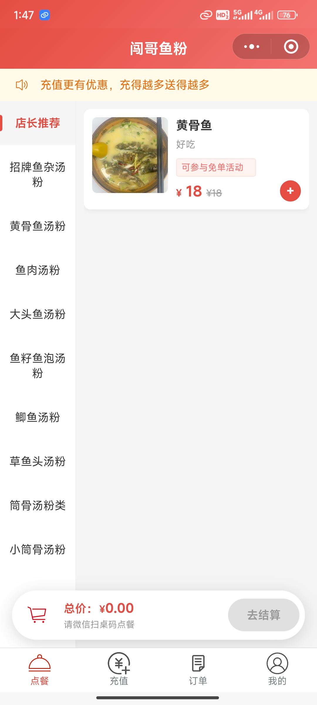
      <br />
      <div align="center">点餐页面</div>
    </td>
    <td width="25%">
      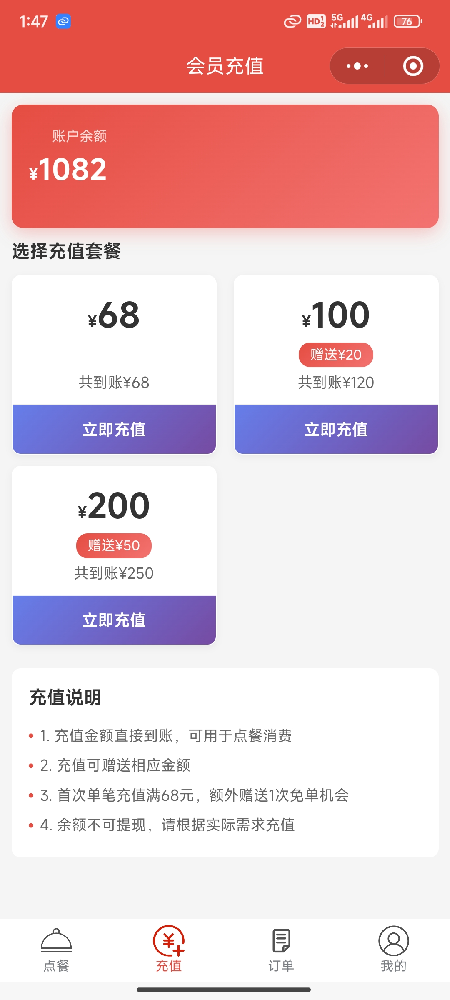
      <br />
      <div align="center">充值页面</div>
    </td>
    <td width="25%">
      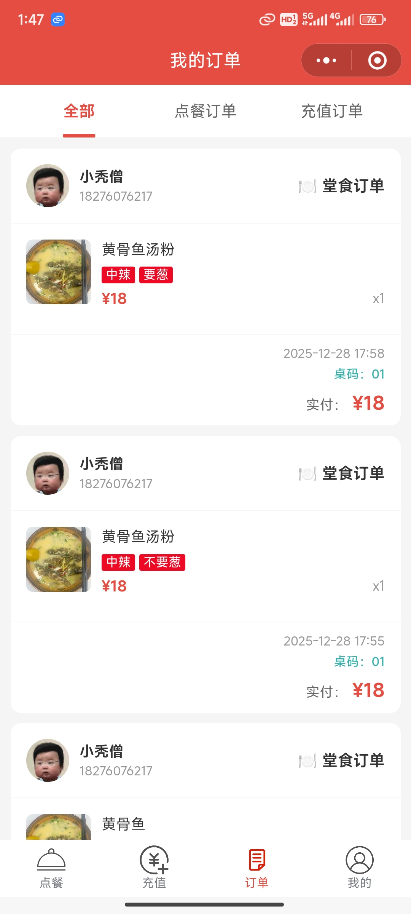
      <br />
      <div align="center">我的订单页面</div>
    </td>
    <td width="25%">
      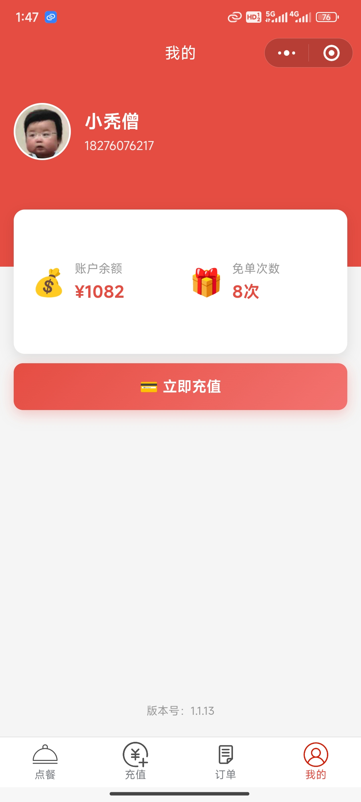
      <br />
      <div align="center">个人中心页面</div>
    </td>
  </tr>
  <tr>
   <td width="25%">
      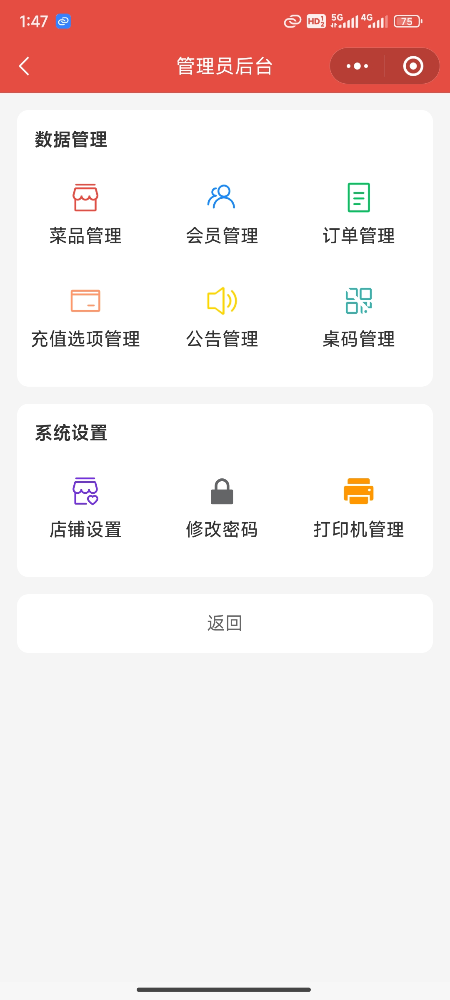
      <br />
      <div align="center">管理员页面</div>
   </td>
   <td width="25%">
      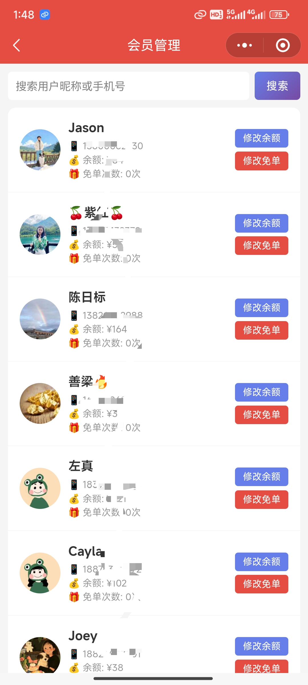
      <br />
      <div align="center">会员页面</div>
    </td>
    <td width="25%">
      
      <br />
      <div align="center">打印机管理页面</div>
    </td>
    <td width="25%">
      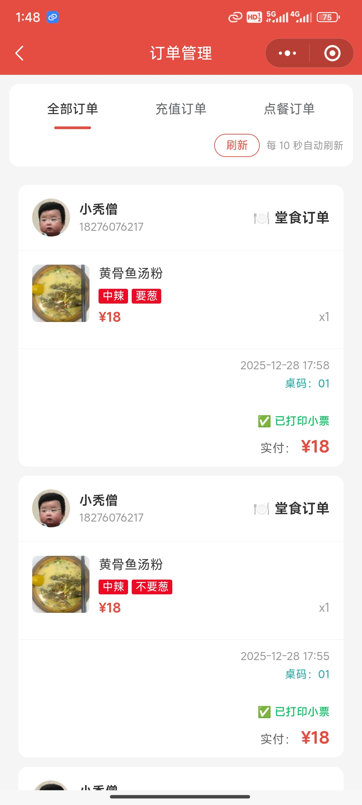
      <br />
      <div align="center">管理员订单页面</div>
    </td>
  </tr>
  <tr>
   <td width="25%">
      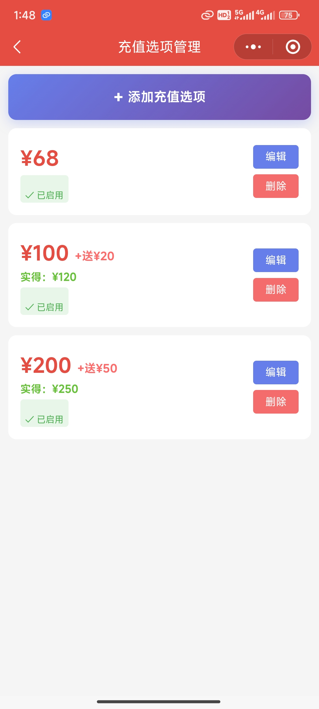
      <br />
      <div align="center">充值套餐设置页面</div>
   </td>
   <td width="25%">
      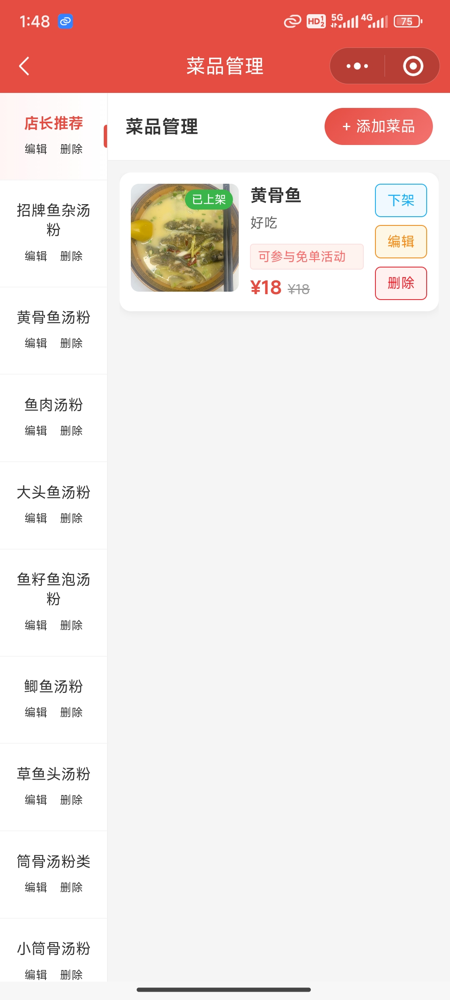
      <br />
      <div align="center">编辑菜品页面</div>
    </td>
    <td width="25%">
      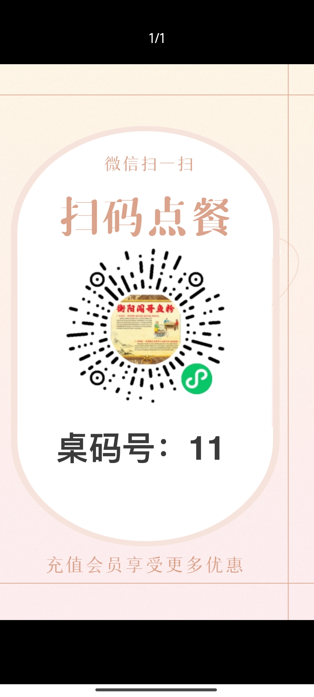
      <br />
      <div align="center">一键生成桌码</div>
    </td>
    <td width="25%">
      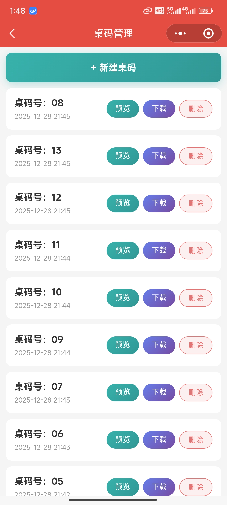
      <br />
      <div align="center">桌码管理页面</div>
    </td>
  </tr>
  <tr>
   <td width="25%">
      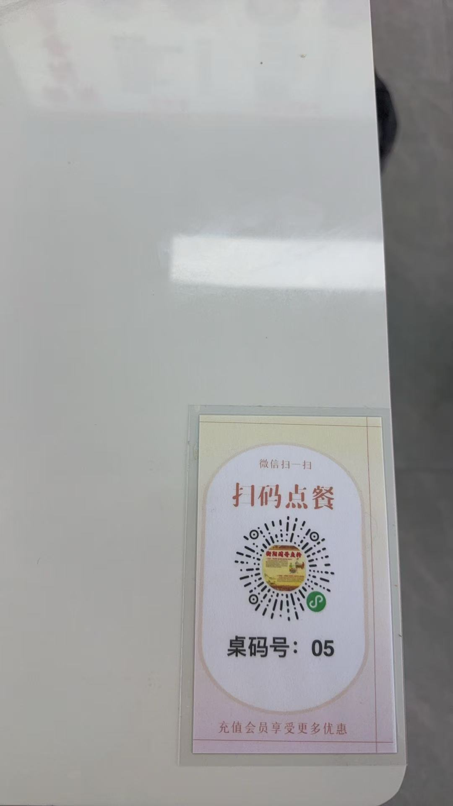
      <br />
      <div align="center">桌码示例</div>
   </td>
   <td width="25%">
      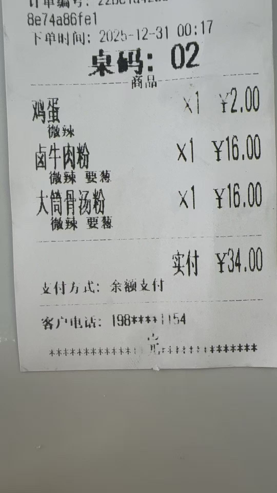
      <br />
      <div align="center">小票示例</div>
    </td>
  </tr>
</table>


---

## ✨ 功能简介

### 👤 顾客功能

#### 1. 在线点餐
- ✅ 菜品分类浏览，清晰直观
- ✅ 购物车管理，方便快捷
- ✅ 微信支付、余额支付
- ✅ 免单机会使用，优惠多多
#### 2. 会员充值（充值68，免单一次，后续可以自己改）
- ✅ 充值即成为会员
- ✅ 多种充值套餐可选，灵活配置

#### 3. 订单管理
- ✅ 查看点餐订单
- ✅ 查看充值记录，一目了然

#### 4. 个人中心
- ✅ 余额查询，实时显示
- ✅ 免单次数显示

### 🛠️ 管理员功能

#### 数据管理
- ✅ **菜品管理** - 添加、编辑、删除菜品，设置价格、图片、描述等
- ✅ **菜品分类管理** - 管理菜品分类，支持排序
- ✅ **会员管理** - 查看会员列表，修改会员余额和免单次数
- ✅ **订单管理** - 查看所有订单
- ✅ **充值选项管理** - 设置充值套餐和赠送规则
- ✅ **公告管理** - 设置小程序公告信息，发布优惠活动

#### 系统设置
- ✅ **店铺设置** - 配置店铺基本信息（名称等）
- ✅ **桌码管理** - 管理桌号信息，生成桌码海报（如使用桌号功能）
- ✅ **打印机管理** - 配置小票打印机，支持自动打印订单
- ✅ **修改密码** - 修改管理员登录密码

> 💡 **进入管理员界面的方法**：在"我的"页面右下角连续点击5次即可进入管理后台

### 🎨 设计特色

- ❤️ 红色主题，温馨大气
- 📱 简洁现代的UI设计
- 🚀 流畅的用户体验
- 💫 精美的动画效果

---

## 🚀 快速部署

### 环境要求

- 微信开发者工具（最新版本）
- 已注册并且备案成功的微信小程序账号
- 已开通微信云开发

### 部署步骤

#### 1. 获取项目代码

```bash
git clone [项目地址]
cd orderFood-wxCloud
```

#### 2. 配置云开发环境

1. 在微信开发者工具中打开项目
2. 开通云开发，创建云环境
3. 获取云环境ID（在云开发控制台顶部查看）

#### 3. 修改配置文件

**修改小程序入口文件** `miniprogram/app.js`（第18行）：

```javascript
wx.cloud.init({
  env: '你的云环境ID',  // 替换为你的实际环境ID
  traceUser: true,
})
```

**修改所有云函数配置文件**（在 `cloudfunctions` 目录下的各个云函数 `index.js` 文件中）：

将所有 `'填写你的环境ID'` 替换为你的实际云环境ID。

需要修改的云函数：
- `login/index.js`
- `getCategory/index.js`
- `doBuy/index.js`
- `pay/index.js` （这个微信支付云函数还需要改subMchId商户号改成自己的商户号ID）
- `pay_success/index.js`
- `get_code/index.js`
- `getPhoneNumber/index.js`
- `getUserList/index.js`
- `printBack/index.js`
- `printManage/index.js` (这个打印机管理员云函数还需要改appid、appsecret，访问：https://open.trenditiot.com 可申请打印机 AppID、appsecret，打印小票机也是找这家买)

#### 4. 创建数据库集合

在云开发控制台 → 数据库中创建以下集合：

- `user` - 用户表
- `dish` - 菜品表
- `dishCategory` - 菜单分类表
- `notice` - 公告通知表
- `order` - 订单表（点餐订单和充值订单）
- `printer` - 打印机表
- `order` - 订单表
- `rechargeOptions` - 充值套餐表
- `freeBuy` - 免单记录表
- `shopInfo` - 店铺表
- `admin` - 管理员表
- `tableCode` - 桌码表


> 💡 **提示**：所有集合的权限都设置为：自定义安全规则：

```
{
  "read": true,
  "write": true
}
```

#### 5. 上传云函数

在微信开发者工具中，右键点击每个云函数文件夹，选择：

**上传并部署：云端安装依赖**

需要上传的云函数：
- `login` - 用户登录
- `getCategory` - 获取菜品分类
- `doBuy` - 执行购买/下单
- `pay` - 支付相关
- `pay_success` - 支付成功回调
- `get_code` - 生成小程序码
- `getPhoneNumber` - 获取手机号
- `getUserList` - 获取用户列表
- `printBack` - 打印机回调处理
- `printManage` - 打印机管理


#### 6. 运行项目

1. 在微信开发者工具中点击"编译"按钮
2. 小程序会自动运行并显示在模拟器中

#### 7. 进入管理后台

1. 点击底部"我的"标签，进入个人中心
2. **在页面右下角空白区域连续快速点击 5 次**（1秒内完成）
3. 首次使用会弹出"设置管理员密码"弹窗，输入至少6位密码
4. 设置成功后自动跳转到管理后台
5. 在管理后台中可以：
   - 设置店铺信息
   - 添加菜品分类和菜品
   - 设置充值套餐
   - 管理订单和会员
   - 打印机管理、公告管理功能


---

## 📝 其他说明

### 1、技术栈

- 微信云开发（云函数 + 云数据库）
- UI框架：Vant Weapp + ColorUI
### 2、微信支付如何授权

点击“云开发”进入云开发控制台-点击“设置”-点击“其他设置”-点击“授权”，商户号管理员收到授权消息-点击授权即可。

### 3、成本

- 小程序认证费：30块
- 打印小票机:259块左右

成本不到300块就拥有自己的点餐小程序。


---

## 💰 打赏支持

如果这个项目对你有帮助，欢迎打赏支持！

部署遇到问题的，需要协助可以v：yxh1168888


<div align="center">
  
</div>

---

**祝生意兴隆！** 🎉
